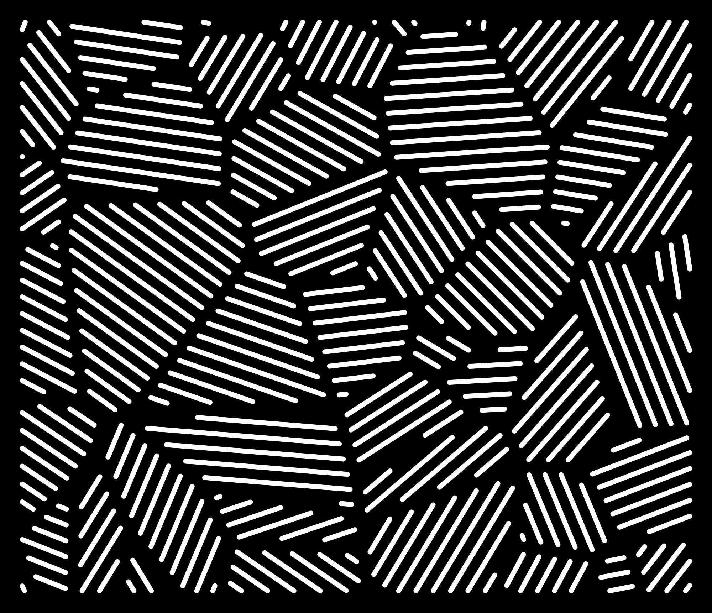
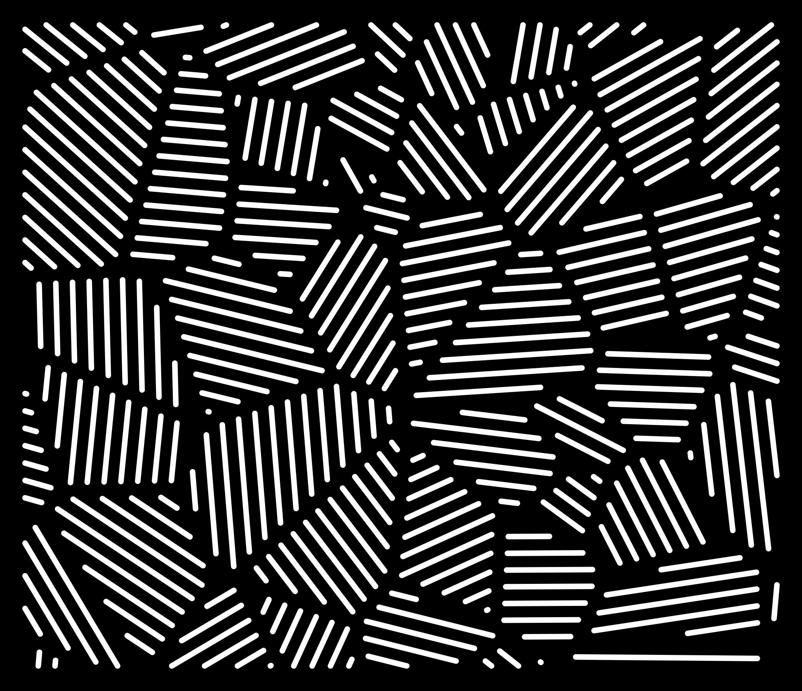
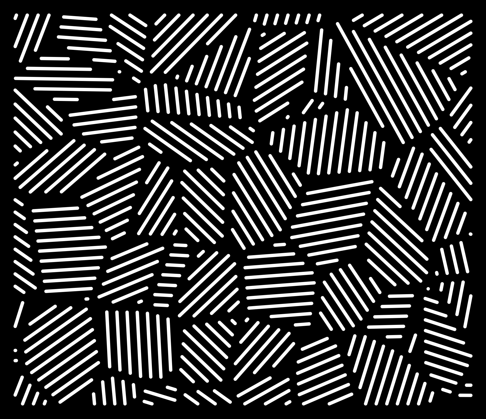
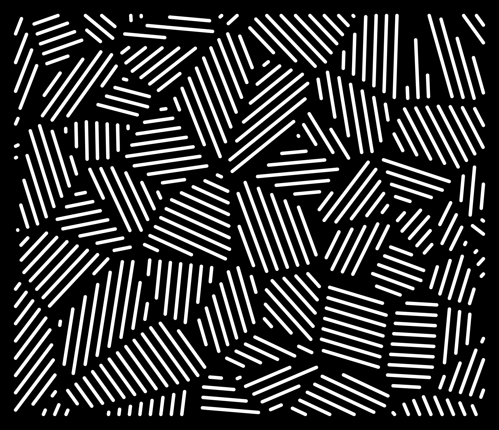
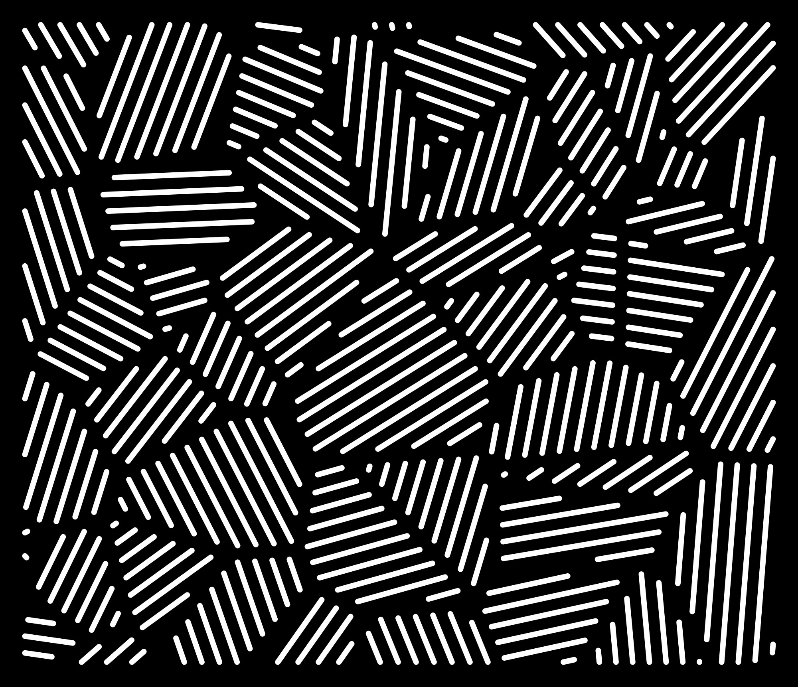

# drawings

Computer-generated drawings for pen plotting and laser/CNC cutting.


## Contents

| File | What it is |
|---|---|
| [jasperjohns.py](jasperjohns.py) | Voronoi crosshatch panel generator — the main script here. Exports a cuttable DXF profile and a preview JPG. |
| [dots.py](dots.py) | Particle-repulsion sketch: two spiral clusters of dots that push apart from each other over time, rendered with matplotlib. |
| [Circles.html](Circles.html) | Canvas sketch that packs random non-overlapping circles onto a 550×550 square. Open the file in a browser to run it. |
| [variants/](variants/) | 20 pre-generated `jasperjohns.py` panels (seeds 1–20, DXF + JPG each) for browsing before committing to one. |
| [export.dxf](export.dxf) / [export.jpg](export.jpg) | Default output location for `jasperjohns.py` — gets overwritten on a plain run. |

## jasperjohns.py

Scatters seed points, builds a Voronoi tessellation, and hatches each cell with parallel stripes at a random angle — a nod to Jasper Johns' crosshatch paintings. Every stripe becomes a stadium-shaped slot (two flanks, two rounded caps) sized and spaced so neighbouring slots never touch, with a solid border around the outside. The result exports as:

- a DXF profile (outer boundary + every slot outline, in real inches) for CNC routing, laser cutting, or a pen plotter, and
- a JPG showing the plate filled solid black with the slots cut out white, so it reads the way the finished part will look.



### Gallery

A few more of the pre-generated panels in [variants/](variants/) — same defaults, different `--seed`:

<p>




</p>

### Setup

```sh
python3 -m venv .venv
.venv/bin/pip install -r requirements.txt
```

(Needed because Homebrew's system `python3` on macOS blocks `pip install` outside a venv.)

### Usage

```sh
.venv/bin/python jasperjohns.py                          # 36x31 in panel, defaults below
.venv/bin/python jasperjohns.py --size 24x48 --seed 7     # custom size, repeatable
.venv/bin/python jasperjohns.py --diameter 0.5 --spacing 0.75 --strut 1
```

| Option | Default | Meaning |
|---|---|---|
| `--size LxW` | `36x31` | panel dimensions in inches, length along x |
| `--diameter` | `0.25` | slot width across the round end |
| `--spacing` | `0.5` | material between adjacent slots *within* one region, edge to edge |
| `--strut` | `0.5` | material between slots of *neighbouring* regions |
| `--border` | `1.0` | solid margin inset from the outer edge — no slots intrude into it |
| `--cells` | `100` | number of Voronoi seed points (more = smaller regions) |
| `--seed` | random | fixes the layout so a run is reproducible |
| `--out` | `export.dxf` | DXF path to write |
| `--jpg` | `<out>.jpg` | JPG path to write |
| `--dpi` | `200` | JPG resolution |
| `--no-preview` | off | skip popping up the matplotlib preview window |

Run `.venv/bin/python jasperjohns.py --help` for the full list.
